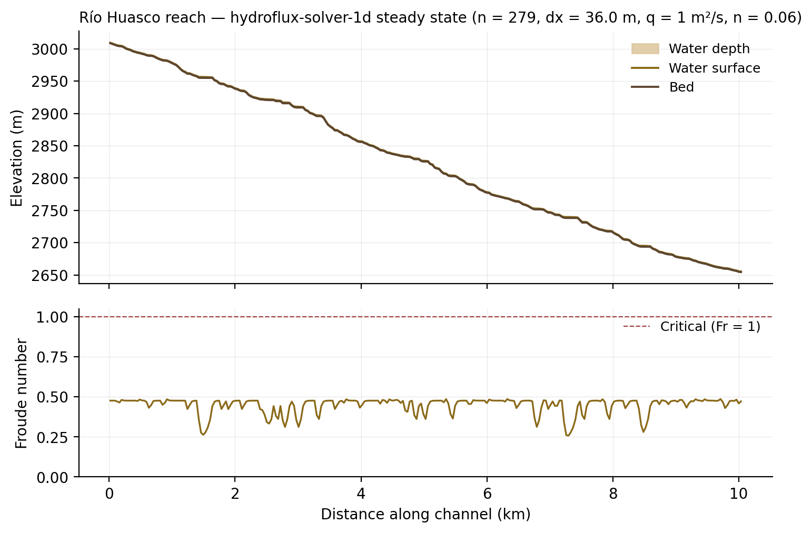

# Demo — Río Huasco reach (semiarid)

Segunda figura insignia: el solver corriendo sobre un tramo Andino
semiárido de la cuenca BNA #06 (Río Huasco). Contrasta con el demo del
Río Maule en clima, pendiente, y rugosidad — mismo solver, distinto
régimen físico.



## Pipeline

Mismo workflow de tres etapas que el demo Maule:

```bash
python3 extract_reach.py
cargo run --release --example run_reach -- \
    examples/huasco_reach_demo/output/bed.tif 0.06 1.0 5000
python3 plot_results.py
```

Los args adicionales del runner (`0.06 1.0 5000`) corresponden a Manning,
descarga unitaria `q` y `t_end`. Defaults del binario son los de Maule
(0.04, 3.0, 5000); los argumentos posicionales los sobrescriben.

## Detalles numéricos

| Magnitud | Valor | Maule (contraste) |
|---|---|---|
| Tramo | 279 celdas × 36.0 m ≈ 10.04 km | 288 × 34.9 m |
| **Bed drop** | **354.2 m** | 102.7 m (3.5× menor) |
| **Mean slope** | **3.53 %** | 1.02 % |
| Cuenca contribuyente | ~180 km² | ~450 km² |
| Elevación inicial – final | 3009 → 2654 m s.n.m. | 585 → 482 m |
| Manning `n` | 0.06 (boulder bed alpino) | 0.04 (cauce rocoso) |
| Descarga unitaria `q` | 1.0 m²/s (evento moderado semiárido) | 3.0 m²/s |
| BC upstream / downstream | `Discharge(q)` / `Depth(h_n)` | (idem) |
| Pasos del solver | 1653 (CFL 0.4) | 2185 |
| Tiempo simulado | 5000 s | 5000 s |
| Profundidad `h` rango | 0.77 – 1.50 m | 1.00 – 1.98 m |
| Velocidad `u` rango | 0.97 – 1.38 m/s | 1.44 – 2.78 m/s |
| **Froude `Fr` rango** | **0.26 – 0.49** | 0.33 – 0.89 |
| Conservación de `q` | 1.11 ± 0.17 m²/s | 2.78 ± 0.21 m²/s |

## Por qué el Froude es MÁS bajo en Huasco a pesar del slope mayor

Contraintuitivo a primera vista, pero el Froude en el Manning normal
depth depende sólo de `S₀` y `n`:

```text
   Fr² = (S₀ · h^(1/3)) / (g · n²)
```

Con `S₀ = 0.035` y `n = 0.06`, `Fr` se estabiliza alrededor de **0.5**
para profundidades de orden de 1 m. La rugosidad alta del boulder bed
absorbe el exceso de pendiente vía mayor fricción.

En Maule, con `S₀ = 0.010` y `n = 0.04`, `Fr` oscila entre 0.3 y 0.9 —
mucho más cerca de crítico en tramos con pendiente local fuerte porque
el bed real tiene ruido sobre la slope media baja.

**Conclusión física**: el Manning más alto del Huasco (cauce rocoso de
montaña) mantiene el régimen lejos de crítico a pesar del slope mayor.
El Maule (cauce más liso) es más sensible a las variaciones locales.

## Selección del tramo

Mismo algoritmo que Maule (D8 walking downstream desde un cell de mayor
flow accumulation), pero filtros adaptados al carácter del basin:

- Elevación 1500–3500 m s.n.m. (Andes propios, headwaters semiáridos)
- Flow accumulation 20 000–200 000 celdas (18–180 km² catchment —
  tributarios mid-size, no el cauce principal del Huasco).

Resultado: tramo iniciando a 3009 m, atravesando boulder bed andino,
terminando a 2654 m s.n.m. después de 10 km.

## Composite figure

`../figures/maule_vs_huasco.png` muestra los dos demos lado a lado.
Generado con `python3 ../composite_figure.py` desde la carpeta
`examples/`. Es la figura insignia del review paper Q4: mismo solver,
dos regímenes físicos, span Mediterranean-temperate (Maule) → semiarid
Andean (Huasco).

## Limitaciones honestas

Aplica todo lo dicho en `../maule_reach_demo/README.md` (no calibrado
contra DGA, q ilustrativo, DEM 30m subestima bathymetry, 1D longitudinal).
Específico de Huasco:

- **Régimen episódico no representado**. El Huasco es semiárido — flujos
  base son a veces ~0 y eventos van a 100s de m³/s. El demo es un steady
  state de evento moderado; no captura el carácter intermitente del
  basin. Para eso entra el solver acoplado con landslide (Years 4–6).
- **Elevación 3000 m**: arriba del límite de bosque, por lo que el
  Manning estándar (que asume rugosidad vegetal) sobre-estima la
  fricción. Un valor más bajo (`n ≈ 0.035`) sería defensible si el
  tramo fuese efectivamente alpino sin riparian. Aquí mantenemos
  `n = 0.06` por consistencia con el tipo bed-roca-boulder.
