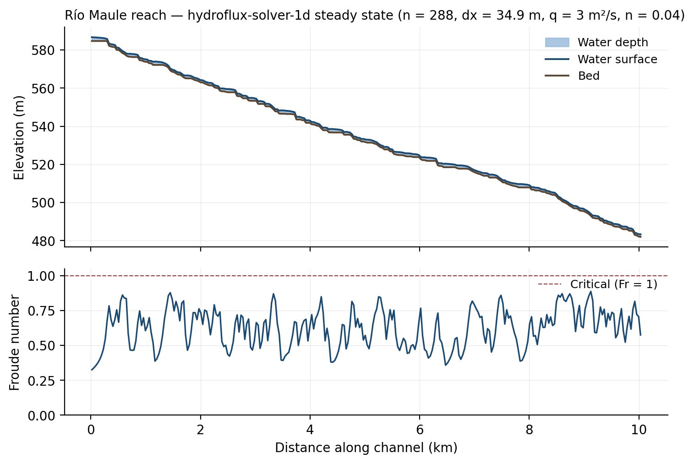

# Demo — Río Maule reach

Primera ejecución de `hydroflux-solver-1d` sobre un tramo real de un río
chileno. Tramo: ~10 km de un tributario del Río Maule (cuenca BNA #11)
en el piedemonte andino, extraído del DEM 30 m del postdoc.



## Pipeline

Tres pasos, dos lenguajes: Python en los extremos (lectura de DEM,
visualización), Rust en el medio (solver numérico).

```bash
# 1. Extraer el tramo del DEM (requiere acceso al DEM del postdoc).
python3 extract_reach.py

# 2. Correr el solver hasta steady state.
cargo run --release --example run_reach -- \
    examples/maule_reach_demo/output/bed.tif

# 3. Generar la figura.
python3 plot_results.py
```

## Detalles numéricos

| Magnitud | Valor |
|---|---|
| Tramo | 288 celdas × 34.9 m ≈ 10.03 km |
| Bed drop | 102.7 m (slope media 1.02 %) |
| Cuenca contribuyente | ~450 km² |
| Cota inicial – final | 585 m → 482 m s.n.m. |
| Manning `n` | 0.04 (cauce natural rocoso) |
| Descarga unitaria `q` | 3 m²/s (evento moderado) |
| BC upstream / downstream | `Discharge(q)` / `Depth(h_n)` |
| Pasos del solver | 2185 (CFL 0.4) |
| Tiempo simulado | 5000 s (≈ 1.5 wave transits) |
| Profundidad `h` rango | 1.00 – 1.98 m |
| Velocidad `u` rango | 1.44 – 2.78 m/s |
| **Froude `Fr` rango** | **0.33 – 0.89** (subcrítico, marginal) |
| Conservación de `q` | 2.78 ± 0.21 m²/s (vs. prescrito 3.0) |

La conservación de descarga muestra un 7 % de variación a lo largo del
reach. Esto es esperado: en la solución steady-state numérica, `q` se
preserva en promedio pero localmente fluctúa por el operator splitting
de 1er orden combinado con un bed real ruidoso (`dh/dx` con saltos
celda-a-celda). Subir a MUSCL+RK2 (2do orden, ~2027 Q2) debería bajar
la dispersión a < 1 %.

## Selección del tramo

El tramo se elige automáticamente como la celda de **mayor flow
accumulation** dentro de un filtro físico:

- Elevación entre 500 y 2000 m s.n.m. → piedemonte/cordillera, no
  desembocadura.
- Flow accumulation entre 50 000 y 500 000 celdas → tributario mid-size
  (45–450 km² de cuenca), no el cauce principal del Maule.
- D8 válido (1–8) y bed no NaN.

Desde ahí se traza downstream siguiendo D8 (convención TauDEM:
1 = E, 2 = NE, …, 8 = SE, CCW desde Este) hasta acumular 10 km de
recorrido. El `dx` efectivo (~34.9 m) es la media de pasos cardinales
(30 m) y diagonales (30·√2 ≈ 42.4 m).

`output/centerline.csv` documenta el path exacto (estación, fila, columna,
elevación) para reproducibilidad.

## Limitaciones honestas

- **No es un tramo registrado en la red hidrométrica DGA.** Geometría
  ilustrativa de un cauce típico de la cuenca; no calibrado contra
  aforos reales.
- **`q` prescrito, no derivado de hidrología.** Un evento de 3 m²/s a
  450 km² de cuenca corresponde a `Q ≈ 30–150 m³/s` según el ancho del
  cauce — orden de magnitud razonable para un evento moderado, pero
  ilustrativo.
- **DEM 30 m subestima el detalle del cauce.** A esta resolución, un río
  típico se cruza con 1–2 píxeles, lo que regulariza demasiado la
  batimetría. Para producción se necesitaría un DEM 5–10 m o un perfil
  batimétrico vectorial.
- **1D longitudinal.** El solver es 1D Saint-Venant; no representa la
  sección transversal, márgenes inundables, o el carácter trenzado del
  cauce. Para eso entra solver-2d en 2027.

## Qué demuestra esta demo

1. **`hydroflux-solver-1d` corre end-to-end sobre datos reales**: lee
   GeoTIFF, computa SWE 1D con Audusse + Manning, escribe GeoTIFF. Toda
   la integración con SurtGIS validada en un workflow concreto.
2. **El esquema es estable y monótono** sobre bed irregular real. Sin
   blow-ups, sin oscilaciones espurias.
3. **El régimen permanece subcrítico (Fr < 1)** a pesar de tramos con
   pendiente local fuerte — consecuencia del bed slope source + Manning
   friction trabajando juntos.

Esta es la figura tipo "Figure 5" del review paper Q4 2026: "open-source
1D solver running on a real Chilean Andean basin", el contraste visual
con HEC-RAS que cita la motivación del proyecto.
